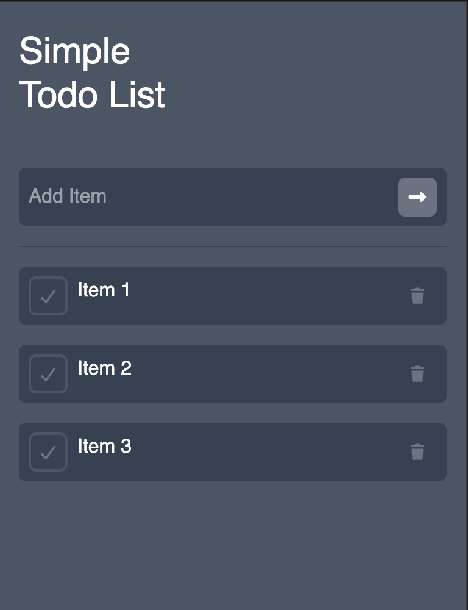

# Simple Todo List

A minimal single page todo list application that lets you add, complete, and delete tasks. Items persist across sessions using local storage so your list is never lost on refresh.

## Features

- Add todo items by typing and pressing **Enter** or clicking the add button.
- Mark items as complete to move them to the completed list.
- Delete items to move them to the deleted list.
- Items persist in local storage across browser sessions.
- Input validation prevents empty items from being added.

## Technologies Used

- **HTML** — Structure of the application.
- **CSS / Tailwind CSS v4** — Styling and layout.
- **TypeScript** — Handles user interactions, DOM manipulation, and local storage.

## How to Use

1. Open the application in a browser: https://tavion-todo-list-app.netlify.app/
2. Type a task into the input field and press **Enter** or click the arrow button to add it.
3. Click the **checkmark** button on any item to mark it as complete.
4. Click the **trash** button on any item to delete it.
5. Your list is automatically saved and will be restored when you reopen the app.

## Screenshot


## Project Structure

```
├── index.html        # App entry point and markup
└── src/
    ├── index.ts      # Entry point — loads storage and renders
    ├── index.css     # Tailwind CSS styles
    ├── elements.ts   # DOM element references
    ├── todos.ts      # Add, complete, and delete logic
    ├── render.ts     # Renders the todo list to the DOM
    ├── storage.ts    # Local storage and list state management
    └── types.ts      # TypeScript interfaces
```